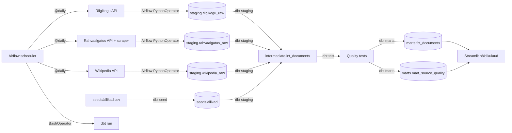

# EKI tekstiandmete grupp — Tekstiandmete maht ja kvaliteet

## Äriküsimus

Kui palju kvaliteetset eestikeelset teksti on võimalik regulaarselt koguda valitud avalikest andmeallikatest?

**Mõõdikud:**

1. Uute sõnade lisandumine ajas allika kohta — näitab mahtu ja aitab tuvastada optimaalse kogumissageduse.
2. Kasutatavuse % allika kohta — kui suur osa kogutud tekstist läbib kvaliteedikontrolli.
3. Peamised kvaliteedipuudused allika kohta — miks tekst ei kvalifitseeru (tekst liiga lühike, vale keel, duplikaat jne).

## Arhitektuur



Täpsem kirjeldus: [`docs/arhitektuur.md`](docs/arhitektuur.md)

## Andmestik

| Allikas | Tüüp | Muutuvus ajas | Kasutus |
|---|---|---|---|
| Riigikogu API | avalik REST API (autentimine puudub) | Uueneb istungipäevadel | Põhiandmevoog — istungite dokumendid ja stenogrammid |
| Rahvaalgatus.ee API + scraper | avalik REST API (autentimine puudub) + HTML scraper | Uueneb reaalajas | Põhiandmevoog — algatuste metaandmed (API) ja täistekst (scraper) |
| Vikipeedia | avalik REST API (autentimine puudub) | Uueneb reaalajas | Põhiandmevoog — artiklite täistekstid |
| `seeds/allikad.csv` | Staatiline dbt seed | Muutub ainult kui lisandub uus allikas | Allikate nimekiri, URL-id, kogumissagedus |
| `seeds/teadaolevad_dokumendid.csv` | Staatiline dbt seed | Ei muutu pärast esimest käivitust | Olemasolevate dokumentide URL-id — duplikaatide vältimiseks esimesel ingest-käivitusel |

Allikad on avalikud ja APId ei nõua autentimist. Rahvaalgatus.ee puhul tagastab API ainult metaandmed; täistekst tõmmatakse eraldi HTTP scraperile avalikelt lehekülgedelt (`robots.txt`: `Disallow:` — kõik lubatud).

## Stack

| Komponent | Tööriist |
|-----------|---------|
| Sissevõtt | [Python / Airflow / muu] |
| Transformatsioon | [SQL / dbt / muu] |
| Andmehoidla | PostgreSQL |
| Näidikulaud | [Superset / Streamlit / muu] |
| Orkestreerimine | [Airflow / cron / muu] |

## Käivitamine

```bash
# 1. Klooni repo ja liigu kausta
git clone <repo-url>
cd <projekti-kaust>

# 2. Kopeeri keskkonnamuutujad
cp .env.example .env
# Muuda .env failis paroolid ja muud seaded vastavalt vajadusele

# 3. Käivita teenused
docker compose up -d --build

# 4. [Vabatahtlik: käivita sissevõtt käsitsi esimesel korral]
# docker compose exec pipeline python scripts/run_pipeline.py run-all
```

Airflow (kui kasutatakse): http://localhost:8080 (kasutaja: airflow / parool: airflow)
Näidikulaud: http://localhost:[PORT]

## Saladused ja konfiguratsioon

Kõik saladused (paroolid, API võtmed, andmebaasi URL-id) on `.env` failis. Repos on ainult `.env.example`, mis näitab vajalike muutujate struktuuri ilma tegelike väärtusteta. Päris `.env` faili ei tohi GitHubi panna - see on `.gitignore`-s.

Vajalikud muutujad:

| Muutuja | Tähendus | Näide |
|---------|----------|-------|
| `DB_PASSWORD` | PostgreSQL parool | (saladus) |
| `[teised]` | ... | ... |

## Andmevoog lühidalt

1. **Sissevõtt** — [Kirjelda, kuidas andmed allikast kätte saadakse]
2. **Laadimine** — Andmed laaditakse `staging` kihti
3. **Transformatsioon** — [Kirjelda peamised arvutused ja mudelid]
4. **Testimine** — [Mitu] andmekvaliteedi testi kontrollivad korrektsust
5. **Näidikulaud** — [Kirjelda lühidalt, mida näidikulaud näitab]

## Andmekvaliteedi testid

Projekt kontrollib järgmist:

1. [Test 1 - nt: kasutajate ID on unikaalne]
2. [Test 2 - nt: tellimuse summa pole null]
3. [Test 3 - nt: kuupäev jääb vahemikku 2020-2026]
[Lisa rohkem, kui sul on]

Testide tulemused: [kuhu salvestatakse / kuidas vaadata]

## Projekti struktuur

```
.
├── README.md
├── compose.yml
├── .env.example
├── .gitignore
├── docs/
│   ├── arhitektuur.md      ← nädal 1 väljund
│   └── progress.md         ← nädal 2 väljund
└── ...                     ← ülejäänud projektifailid
```

## Kokkuvõte, puudused ja võimalikud edasiarendused

**Kokkuvõte:**
- [Loetle, mis on lõpule viidud, mis töötab hästi]

**Puudused:**
- [Loetle ausalt, mis jäi tegemata - see ei mõjuta hinnet negatiivselt, vaid aitab hinnata]

**Mis edasi:**
- [Mida tahaksid edasi teha, kui aega oleks rohkem]

## Meeskond

| Nimi | Roll | Vastutus |
|---|---|---|
| Eleri | Andmeallika ja transformatsioonide omanik | Hoiab andmevoo töökorras — sissevõtust transformatsioonide ja orkestreerimiseni |
| Evelin | Kvaliteedi omanik | Kirjutab ja hoiab dbt testid ajakohasena |
| Liis | Näidikulaua omanik | Haldab staatilisi seed-tabeleid ja näidikulauda |
