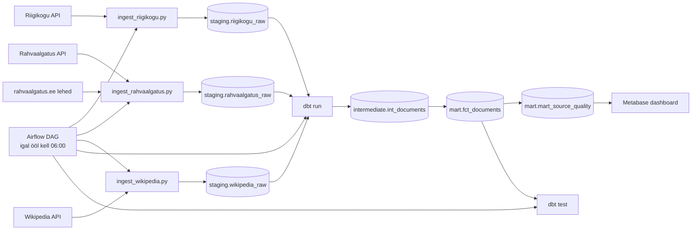

# Arhitektuur

## Äriküsimus

Kui palju kvaliteetset eestikeelset teksti on võimalik regulaarselt koguda valitud avalikest andmeallikatest?

## Mõõdikud

1. Uute sõnade lisandumine ajas allika kohta — näitab mahtu ja aitab tuvastada optimaalse kogumissageduse.
2. Kasutatavuse % allika kohta — kui suur osa kogutud tekstist läbib kvaliteedikontrolli.
3. Peamised kvaliteedipuudused allika kohta — miks tekst ei kvalifitseeru (tekst liiga lühike, vale keel, duplikaat jne).

## Andmeallikad

| Allikas | Tüüp | Muutuvus ajas | Kasutus |
|---|---|---|---|
| Riigikogu API | Avalik HTTP API | Uueneb istungipäevadel | Põhiandmevoog — istungite dokumendid ja stenogrammid |
| Rahvaalgatus.ee API + scraper | Avalik HTTP API + HTML scraper | Uueneb reaalajas | Põhiandmevoog — algatuste metaandmed (API) ja täistekst (scraper) |
| Eesti Wikipedia | MediaWiki HTTP API | Uueneb reaalajas | Põhiandmevoog — artiklite täistekst |
| `seeds/allikad.csv` | Staatiline dbt seed | Muutub ainult projekti muutmisel | Allikate nimekiri, URL-id, uuenussagedus |

Kõik kolm allikat on avalikud ja ei nõua autentimist. Rahvaalgatus.ee puhul tagastab API ainult metaandmed; täistekst tõmmatakse eraldi HTTP scraperига avalikelt lehekülgedelt (`robots.txt`: `Disallow:` — kõik lubatud).

## Andmevoog

## Andmebaasi kihid

| Kiht | Tüüp | Roll |
|---|---|---|
| `staging` | Tabel | API-st ja scraperист saadud toorandmed. Iga käivitus lisab ainult uued read (`ON CONFLICT DO NOTHING`). Vanad andmed jäävad alles. |
| `intermediate` | Vaade | Puhastamine + kvaliteedilipud (`is_long_enough`, `is_estonian`, `is_not_duplicate`) + sõnade loendamine. |
| `mart` | Tabel | `fct_documents` ühendab kõik allikad. `mart_source_quality` arvutab mõõdikud allika ja päeva lõikes. |

Iga töövoo käivitus saab unikaalse `run_id`. Staging toorandmed kasvavad kumulatiivselt. Mart tabelid ehitatakse iga käivitusega uuesti — näidikulaud loeb alati viimast seisu.

## Tööjaotus

| Liige | Roll | Vastutus |
|---|---|---|
| Eleri (edasijõudnud) | Andmeallika ja transformatsioonide omanik | Kirjutab sissevõtu loogika Riigikogu API najal, transformatsioonid ja mõõdikute arvutuse, Airflow DAG-id, Docker seadistus |
| Evelin (algaja) | Kvaliteedi omanik | Rahvaalgatus.ee API kontroll, kirjutab dbt kvaliteeditestid, valmistab ette mõõdikute arvutuse loogika |
| Liis (algaja) | Näidikulaua omanik | Wikipedia API kontroll, valmistab ette staatilise andmetabeli (seeds), valmistab ette näidikulaua vaated |

## Riskid

| Risk | Mõju | Maandus |
|---|---|---|
| Rahvaalgatus.ee muudab HTML struktuuri | Scraper ei leia teksti | Scraper logib vead; metaandmed jäävad alles; tekst märgitakse puuduvaks |
| Riigikogu API ei vasta | Andmeid ei lisandu | Airflow `retries=2`; järgmine käivitus proovib uuesti |
| Wikipedia artikkel kustutatakse | Vana tekst jääb staging-isse | `ON CONFLICT DO UPDATE` uuendab teksti |
| dbt testid ebaõnnestuvad | Vigased andmed jõuavad dashboardile | Airflow märgib DAG punaseks; andmed on nähtavad aga märgistatud |
| Airflow scheduler ei käivitu | Andmed ei värskene | Kontrolli `docker compose logs airflow`; ingest-skripte saab käivitada ka käsitsi |

## Privaatsus ja turve

Projekt kasutab ainult avalikke andmeid. Isikuandmeid ei koguta. Rahvaalgatus.ee algatused on avalik kodanikuplatvorm — scraping on lubatud (`robots.txt: Disallow:` ilma väärtuseta). Andmebaasi kasutajanimi ja parool tulevad `.env` failist. Päris `.env` faili ei tohi reposse lisada — ainult `.env.example`.
