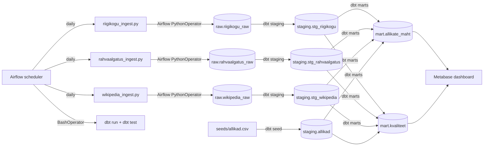

# Arhitektuur

## Äriküsimus

Kui palju kvaliteetset eestikeelset teksti on võimalik regulaarselt koguda valitud avalikest andmeallikatest?

## Mõõdikud

1. **Kasutatava teksti kogumaht sõnades allika kohta ajas** - kui järjepidev on andmehulga kasv ja kui tihti tasub allikast andmeid pärida?
2. **Kasutatavuse % allika kohta** - kui suur osa kogutud tekstiandmetest on kvaliteetsed?
3. **Peamised kvaliteedipuudused allika kohta** - miks andmed ei kvalifitseeru edaspidiseks kasutamiseks?

> Dokument loetakse kasutatavaks, kui ta läbib andmekvaliteedi testid:
> mitte-null väljad, piisav pikkus (≥100 tähemärki), korrektne keel (eesti),
> duplikaatide puudumine.

---

## Andmevoog

---

## Andmebaasi kihid

| Kiht | Roll |
|------|------|
| `staging` |  (toorandmed)Hoiab API-st ja scraperi-st saadud dokumendid võimalikult allikalähedaselt. Iga käivitus lisab ainult uued read (ON CONFLICT DO NOTHING). Vanad andmed jäävad alles. |
| `intermediate` | stg_riigikogu, stg_rahvaalgatus, stg_wikipedia — puhastatud ja normaliseeritud vaated toorandmetest. Lisab kvaliteedilipud (has_title, has_sufficient_text, has_date).|
| `mart` | fct_documents ühendab kõik allikad üheks faktitabeliks. mart_source_quality arvutab mõõdikud allika ja päeva lõikes (sõnade arv, kasutatavuse %, kvaliteedipuudused). |

---

## Andmeallikad

| Allikas | Tüüp | Ajas muutuv? | Roll |
|---------|------|--------------|------|
| Riigikogu API | API (REST/JSON) | Jah, istungipäevadel | Põhiandmevoog — stenogrammid, eelnõud, päevakorrad |
| Rahvaalgatus.ee API | API (REST/JSON) | Jah, reaalajas | Põhiandmevoog — kodanike algatused ja allkirjad |
| Vikipeedia (et) API | API (MediaWiki) | Jah, reaalajas | Põhiandmevoog — eestikeelsed artiklid |
| seeds/allikad.csv | Staatiline CSV (dbt seed) | Ei | Kõrvaltabel — allikate metaandmed, aitab eristada uut vanast |

---

## Tööjaotus

| Vastutus | Täitja |
|----------|--------|
| Repo, Docker, Airflow DAG-id, dbt aluspõhi, Riigikogu integratsioon, dashboard | Eleri |
| Rahvaalgatus + Vikipeedia API sissevõtt, dbt kvaliteeditestid | Evelin |
| CSV seed-id, uute/vanade dokumentide eristamise loogika, README, video koordineerimine | Liis |

---

## Riskid

| Risk | Tõenäosus | Leevendus |
|------|-----------|-----------|
| Riigikogu API muudab struktuuri või läheb maas | keskmine | Raw-kiht salvestab vastuse muutmata kujul; staging eraldab sõltuvuse API struktuurist |
| Algajad takerduvad dbt/Airflow seadistusse | kõrge | Edasijõudnu seadistab keskkonna ette ja kirjutab koodimallid; algajad täidavad malli |
| Vikipeedia API rate-limit | madal | Lisame viivituse päringute vahele, kasutame `continue`-parameetrit lehekülgede vahel |
| Evelin on puhkusel 1.–7. juunil (nädal 3) | teada | Evelin teeb oma ülesanded valmis enne 1. juunit; video salvestab ette |
| Duplikaadid korduvpäringute vahel | kõrge | Hoiame `raw` tabelis viimase päringu `ingested_at` ajatempli ja filtreerime staging-kihis |

---

## Privaatsus ja turve

Projekt kasutab ainult avalikke andmeid (Riigikogu, Rahvaalgatus.ee,
Vikipeedia). Isikuandmeid tahtlikult ei koguta. Riigikogu stenogrammides
võivad esineda isikute nimed avaliku rolli kontekstis — see on avalik info.

Andmebaasi paroolid ja muud saladused tulevad `.env` failist.
Päris `.env` faili ei tohi GitHubi panna — see on `.gitignore`-s.
Repos on ainult `.env.example` näidisväärtustega.
