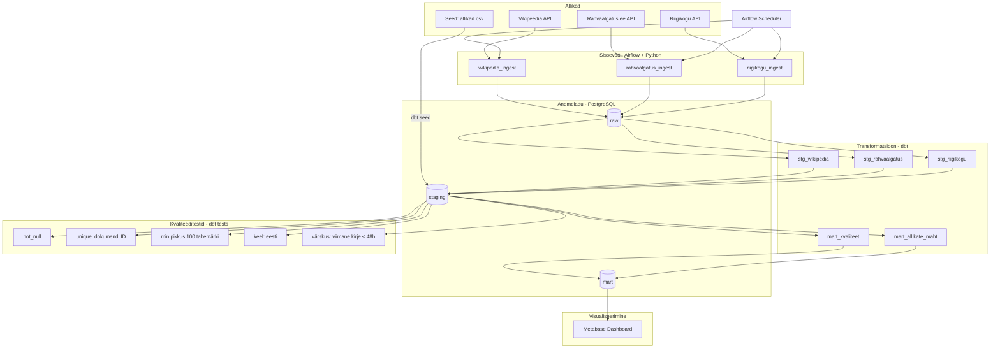

# Arhitektuur

## Äriküsimus

Millised avalikud eestikeelsed andmeallikad annavad suurima mahu
kvaliteetseid ja kasutatavaid tekstiandmeid regulaarseks andmekogumiseks?

## Mõõdikud

1. **Uute dokumentide arv allika kohta ajas** — kas allikas kasvab ootuspäraselt?
2. **Kvaliteedikontrolli läbimise %** — kui suur osa kogutud dokumentidest on tegelikult kasutatavad?
3. **Kasutatavate dokumentide koguarv allika kohta** — absoluutne maht analüüsi jaoks

> Dokument loetakse kasutatavaks, kui ta läbib andmekvaliteedi testid:
> mitte-null väljad, piisav pikkus (≥100 tähemärki), korrektne keel (eesti),
> duplikaatide puudumine.

---

## Andmevoog

---

## Andmebaasi kihid

| Kiht | Roll |
|------|------|
| `raw` | Hoiab allika andmeid töötlemata kujul täpselt nii nagu API tagastas. Kirjeid ei muudeta ega kustutata. |
| `staging` | Puhastatud ja normaliseeritud andmed: veergude nimed ühtlustatud, tüübid konverteeritud, duplikaadid eemaldatud. |
| `mart` | Agregeeritud tabelid dashboardi jaoks: dokumentide arv allika ja kuupäeva järgi, kvaliteedistatistika allika kohta. |

---

## Andmeallikad

| Allikas | Tüüp | Ajas muutuv? | Roll |
|---------|------|--------------|------|
| Riigikogu API | API (REST/JSON) | Jah, istungipäevadel | Põhiandmevoog — stenogrammid, eelnõud, päevakorrad |
| Rahvaalgatus.ee API | API (REST/JSON) | Jah, reaalajas | Põhiandmevoog — kodanike algatused ja allkirjad |
| Vikipeedia (et) API | API (MediaWiki) | Jah, reaalajas | Põhiandmevoog — eestikeelsed artiklid |
| seeds/allikad.csv | Staatiline CSV (dbt seed) | Ei | Kõrvaltabel — allikate metaandmed, aitab eristada uut vanast |

---

## Tööjaotus

| Vastutus | Täitja |
|----------|--------|
| Repo, Docker, Airflow DAG-id, dbt aluspõhi, Riigikogu integratsioon, dashboard | Eleri |
| Rahvaalgatus + Vikipeedia API sissevõtt, dbt kvaliteeditestid | Evelin |
| CSV seed-id, uute/vanade dokumentide eristamise loogika, README, video koordineerimine | Liis |

---

## Riskid

| Risk | Tõenäosus | Leevendus |
|------|-----------|-----------|
| Riigikogu API muudab struktuuri või läheb maas | keskmine | Raw-kiht salvestab vastuse muutmata kujul; staging eraldab sõltuvuse API struktuurist |
| Algajad takerduvad dbt/Airflow seadistusse | kõrge | Edasijõudnu seadistab keskkonna ette ja kirjutab koodimallid; algajad täidavad malli |
| Vikipeedia API rate-limit | madal | Lisame viivituse päringute vahele, kasutame `continue`-parameetrit lehekülgede vahel |
| Kolleeg E on puhkusel 1.–7. juunil (nädal 3) | teada | E teeb oma ülesanded valmis enne 1. juunit; video salvestab ette |
| Duplikaadid korduvpäringute vahel | kõrge | Hoiame `raw` tabelis viimase päringu `ingested_at` ajatempli ja filtreerime staging-kihis |

---

## Privaatsus ja turve

Projekt kasutab ainult avalikke andmeid (Riigikogu, Rahvaalgatus.ee,
Vikipeedia). Isikuandmeid tahtlikult ei koguta. Riigikogu stenogrammides
võivad esineda isikute nimed avaliku rolli kontekstis — see on avalik info.

Andmebaasi paroolid ja muud saladused tulevad `.env` failist.
Päris `.env` faili ei tohi GitHubi panna — see on `.gitignore`-s.
Repos on ainult `.env.example` näidisväärtustega.
