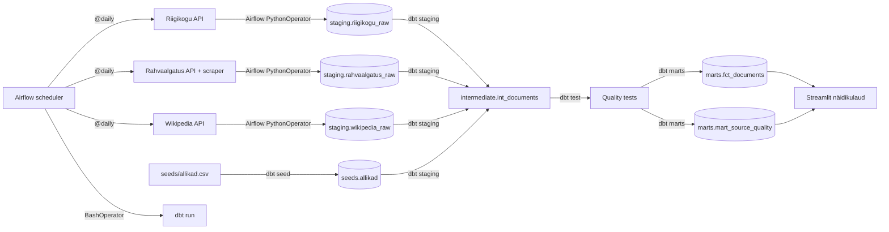

# Arhitektuur

## Äriküsimus

Kui palju kvaliteetset eestikeelset teksti on võimalik regulaarselt koguda valitud avalikest andmeallikatest?

## Mõõdikud

1. Uute sõnade lisandumine ajas allika kohta — näitab mahtu ja aitab tuvastada optimaalse kogumissageduse.
2. Kasutatavuse % allika kohta — kui suur osa kogutud tekstist läbib kvaliteedikontrolli.
3. Peamised kvaliteedipuudused allika kohta — miks tekst ei kvalifitseeru (tekst liiga lühike, vale keel, duplikaat jne).

## Andmeallikad

| Allikas | Tüüp | Muutuvus ajas | Kasutus |
|---|---|---|---|
| Riigikogu API | avalik REST API (autentimine puudub) | Uueneb istungipäevadel | Põhiandmevoog — istungite dokumendid ja stenogrammid |
| Rahvaalgatus.ee API + scraper | avalik REST API (autentimine puudub) + HTML scraper | Uueneb reaalajas | Põhiandmevoog — algatuste metaandmed (API) ja täistekst (scraper) |
| Eesti Wikipedia | avalik REST API (autentimine puudub) | Uueneb reaalajas | Põhiandmevoog — artiklite täistekstid |
| `seeds/allikad.csv` | Staatiline dbt seed | Muutub ainult kui lisandub uus allikas | Allikate nimekiri, URL-id, kogumissagedus |
| `seeds/teadaolevad_dokumendid.csv` | Staatiline dbt seed | Ei muutu pärast esimest käivitust | Olemasolevate dokumentide URL-id — duplikaatide vältimiseks esimesel ingest-käivitusel |

Allikad on avalikud ja APId ei nõua autentimist. Rahvaalgatus.ee puhul tagastab API ainult metaandmed; täistekst tõmmatakse eraldi HTTP scraperile avalikelt lehekülgedelt (`robots.txt`: `Disallow:` — kõik lubatud).

## Andmevoog

## Andmebaasi kihid

| Kiht | Tüüp | Roll |
|---|---|---|
| `staging` | Tabel | API-st ja scraperilt saadud toorandmed. Iga käivitus lisab ainult uued read (`ON CONFLICT DO NOTHING`). Vanad andmed jäävad alles. |
| `intermediate` | Vaade | Puhastamine + kvaliteedilipud (`is_long_enough`, `is_estonian`, `is_not_duplicate`) + sõnade loendamine (`word_count`). |
| `marts` | Tabel | `fct_documents` ühendab kõik allikad. `mart_source_quality` arvutab mõõdikud allika ja päeva lõikes. |

Iga töövoo käivitus saab unikaalse `run_id`. Staging toorandmed kasvavad kumulatiivselt. Mart tabelid ehitatakse iga käivitusega uuesti — näidikulaud loeb alati viimast seisu.

## Tööjaotus

| Liige | Roll | Vastutus |
|---|---|---|
| Eleri | Andmeallika ja transformatsioonide omanik | Hoiab andmevoo töökorras — sissevõtust transformatsioonide ja orkestreerimiseni |
| Evelin | Kvaliteedi omanik | Kirjutab ja hoiab dbt testid ajakohasena |
| Liis | Näidikulaua omanik | Haldab staatilisi seed-tabeleid ja näidikulauda |

## Riskid

| Risk | Mõju | Maandus |
|---|---|---|
| Riigikogu, Rahvaalgatuse ja/või Vikipeedia API ei vasta | (kõiki) andmeid ei lisandu | Airflow `retries=2`; järgmine käivitus proovib uuesti |
| API muudab väljade nimesid | Airflow Python task jookseb kokku | Skript valideerib nõutud väljad enne kirjutamist; vigased read jäävad logidesse |
| dbt testid ebaõnnestuvad | Näidikulaud võib näidata vigaseid andmeid | dbt test task märgib Airflow töövoo ebaõnnestunuks; Streamlit näitab endiselt viimaseid edukaid andmeid |
| Airflow scheduler ei käivitu | Andmed ei värskene | Kontrolli `docker compose logs airflow`; ingest-skripte saab käivitada ka käsitsi |

## Privaatsus ja turve

Projekt kasutab ainult avalikke andmeid. Isikuandmeid ei koguta. Andmebaasi kasutajanimi ja parool tulevad `.env` failist. Päris `.env` faili ei tohi reposse lisada — ainult `.env.example`.
