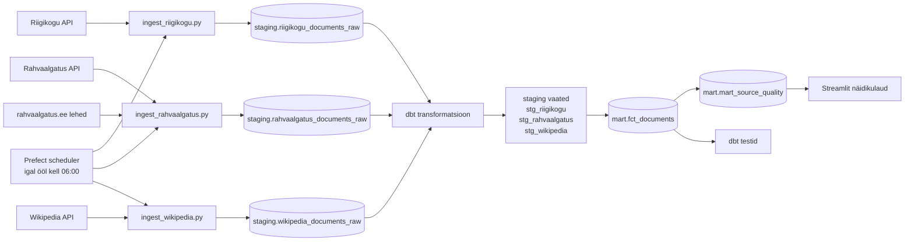

# Arhitektuur

## Äriküsimus

Kui palju kvaliteetset eestikeelset teksti on võimalik regulaarselt koguda valitud avalikest andmeallikatest?

## Mõõdikud

1. Uute sõnade lisandumine ajas allika kohta — näitab mahtu ja aitab tuvastada optimaalse kogumissageduse.
2. Kasutatavuse % allika kohta — kui suur osa kogutud tekstist läbib kvaliteedikontrolli.
3. Peamised kvaliteedipuudused allika kohta — miks tekst ei kvalifitseeru (pealkiri puudub, tekst liiga lühike, duplikaat jne).

## Andmeallikad

| Allikas | Tüüp | Muutuvus ajas | Kasutus |
|---|---|---|---|
| Riigikogu API | Avalik HTTP API | Uueneb istungipäevadel | Põhiandmevoog — istungite dokumendid ja stenogrammid |
| Rahvaalgatus.ee API + scraper | Avalik HTTP API + HTML scraper | Uueneb reaalajas | Põhiandmevoog — algatuste metaandmed (API) ja täistekst (scraper) |
| Eesti Wikipedia | MediaWiki HTTP API | Uueneb reaalajas | Põhiandmevoog — artiklite täistekst |

Kõik kolm allikat on avalikud ja ei nõua autentimist. Rahvaalgatus.ee puhul tagastab API ainult metaandmed; täistekst tõmmatakse eraldi HTTP scraperига avalikelt lehekülgedelt (`robots.txt`: `Disallow:` — kõik lubatud).

## Andmevoog

## Andmebaasi kihid

| Kiht | Roll |
|---|---|
| `staging` (toorandmed) | Hoiab API-st ja scraperi-st saadud dokumendid võimalikult allikalähedaselt. Iga käivitus lisab ainult uued read (`ON CONFLICT DO NOTHING`). Vanad andmed jäävad alles. |
| `staging` (dbt vaated) | `stg_riigikogu`, `stg_rahvaalgatus`, `stg_wikipedia` — puhastatud ja normaliseeritud vaated toorandmetest. Lisab kvaliteedilipud (`has_title`, `has_sufficient_text`, `has_date`). |
| `mart` | `fct_documents` ühendab kõik allikad üheks faktitabeliks. `mart_source_quality` arvutab mõõdikud allika ja päeva lõikes (sõnade arv, kasutatavuse %, kvaliteedipuudused). |

Iga töövoo käivitus saab unikaalse `run_id`. Staging toorandmed kasvavad kumulatiivselt. Mart tabelid ehitatakse iga käivitusega uuesti — näidikulaud loeb alati viimast seisu.

## Tööjaotus

| Liige | Roll | Vastutus |
|---|---|---|
| Mina (edasijõudnud) | Arhitekt + pipeline | Prefect pipeline, Docker seadistus, dbt transformatsioonid |
| Kolleeg E (algaja) | Andmeallikate omanik | Riigikogu ja Wikipedia ingest-skriptid |
| Kolleeg L (algaja) | Kvaliteet + visualisatsioon | dbt testid, Streamlit näidikulaud |

## Riskid

| Risk | Mõju | Maandus |
|---|---|---|
| Rahvaalgatus.ee muudab HTML struktuuri | Scraper ei leia teksti | Scraper logib vead; metaandmed jäävad alles; tekst märgitakse puuduvaks |
| Riigikogu API ei vasta | Andmeid ei lisandu | Prefect `retries=2`; järgmine käivitus proovib uuesti |
| Wikipedia artikkel kustutatakse | Vana tekst jääb staging-isse | `ON CONFLICT DO UPDATE` uuendab teksti; kustutatud artikleid ei eemaldata automaatselt |
| dbt testid ebaõnnestuvad | Vigased andmed jõuavad dashboardile | Prefect logib hoiatuse; pipeline ei peatu — andmed on nähtavad aga märgistatud |
| Prefect scheduler ei käivitu | Andmed ei värskene | Kontrolli `docker compose logs pipeline`; ingest-skripte saab käivitada ka käsitsi |

## Privaatsus ja turve

Projekt kasutab ainult avalikke andmeid. Isikuandmeid ei koguta. Rahvaalgatus.ee algatused on avalikud kodanikuplatvorm — scraping on lubatud (`robots.txt: Disallow:` ilma väärtuseta). Andmebaasi kasutajanimi ja parool tulevad `.env` failist. Päris `.env` faili ei tohi reposse lisada — ainult `.env.example`.
